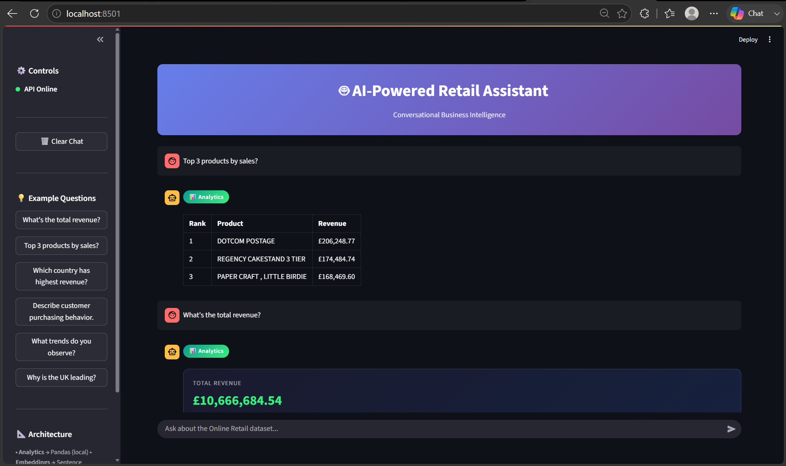

# 🤖 AI-Powered Retail Assistant
### *Conversational Business Intelligence & Hybrid RAG Engine*

<div align="center">

[](https://www.python.org/)
[](https://flask.palletsprojects.com/)
[](https://streamlit.io/)
[](https://python.langchain.com/)
[](https://github.com/facebookresearch/faiss)
[](tests/)
[](LICENSE)

</div>

---

## 📌 Executive Summary

Traditional LLMs hallucinate calculations and cannot be trusted with financial figures. Traditional BI dashboards lack natural language flexibility. 

The **AI-Powered Retail Assistant** solves this tradeoff with a **hybrid routing architecture**:
* 🧮 **Exact Math**: 100% deterministic calculations executed via Pandas across **530,000+ retail records**.
* 🔍 **Semantic Search**: Local FAISS vector retrieval (`all-MiniLM-L6-v2`) on representative transactions.
* 🧠 **Qualitative Insights**: Serverless Hugging Face LLM (`meta-llama/Llama-3.1-8B-Instruct`) for contextual reasoning without numeric fabrication.

---

## 📸 Application Showcase

<div align="center">
  
</div>

| Feature Observed | Technical Implementation | Value to End User |
| :--- | :--- | :--- |
| 🟢 **Live Health Indicator** | Periodic polling of `GET /health` | Instant verification that API services are healthy |
| ⚡ **Preset Question Chips** | State-driven buttons updating prompt input | Zero-friction exploration of key business KPIs |
| 📊 **Metric Card Display** | Custom HTML/CSS component injection | High-visibility executive card for total revenue (£10.66M) |
| 📋 **Structured Data Table** | Markdown table generation from Pandas | Ranked product tables with formatted GBP revenue |
| 🏷️ **Dynamic Route Badges** | Metadata tagging (`analytics`, `rag`, `hybrid`) | Transparent distinction between exact math and AI reasoning |

---

## 🎯 Task Implementation Matrix

| Project Requirement | Technical Solution | Implementation File | Status |
| :--- | :--- | :--- | :---: |
| **Data Ingestion & Cleaning** | Strips returns ('C'), cleans quantities, calculates `Revenue` | [`backend/data_loader.py`](backend/data_loader.py) | ✅ Ready |
| **Deterministic Analytics** | Vectorized Pandas operations for sums, top products, countries | [`backend/analytics.py`](backend/analytics.py) | ✅ Ready |
| **Semantic Retrieval** | Sentence-Transformers embeddings stored in local FAISS index | [`backend/rag.py`](backend/rag.py) | ✅ Ready |
| **LLM Inference** | Serverless Hugging Face router with automated model failover | [`backend/rag.py`](backend/rag.py) | ✅ Ready |
| **Smart Routing** | Intent classifier mapping questions to optimal execution pipeline | [`backend/router.py`](backend/router.py) | ✅ Ready |
| **REST API Gateway** | Flask API exposing `/health` and `/ask` with CORS | [`backend/main.py`](backend/main.py) | ✅ Ready |
| **Interactive Frontend** | Streamlit chat dashboard with dark theme and glassmorphism | [`frontend/app.py`](frontend/app.py) | ✅ Ready |
| **Automated Verification**| 45 unit/integration tests with mocked external dependencies | [`tests/`](tests/) | ✅ Passed (45/45) |

---

## 📐 System Architecture

```text
                                  ┌───────────────────────────┐
                                  │   Streamlit Web UI        │
                                  │   (frontend/app.py)       │
                                  └─────────────┬─────────────┘
                                                │ REST API (JSON)
                                                ▼
                                  ┌───────────────────────────┐
                                  │   Flask API Gateway       │
                                  │   (backend/main.py)       │
                                  └─────────────┬─────────────┘
                                                │
                                                ▼
                                  ┌───────────────────────────┐
                                  │   Intent Router & Parser  │
                                  │   (backend/router.py)     │
                                  └──────┬──────┬──────┬──────┘
                                         │      │      │
                     ┌───────────────────┘      │      └───────────────────┐
                     │ "analytics"              │ "hybrid"                 │ "rag"
                     ▼                          ▼                          ▼
        ┌─────────────────────────┐ ┌─────────────────────────┐ ┌─────────────────────────┐
        │    Pandas Engine        │ │   Hybrid Coordinator    │ │   LangChain RAG Pipeline│
        │  (backend/analytics.py) │ │   Metric + Qualitative  │ │   (backend/rag.py)      │
        └────────────┬────────────┘ └───────────┬─────────────┘ └────────────┬────────────┘
                     │                          │                            │
                     ▼                          ▼                            ▼
        ┌─────────────────────────┐ ┌─────────────────────────┐ ┌─────────────────────────┐
        │ Exact Math Computation  │ │ 1. Deterministic Metric │ │ Local MiniLM Embedding  │
        │ Complete Dataset        │ │ 2. FAISS Similarity     │ │ FAISS Vector Search     │
        │ (530,000+ Transactions) │ │ 3. LLM Synthesis        │ │ Hugging Face LLM (Llama)│
        └─────────────────────────┘ └─────────────────────────┘ └─────────────────────────┘
```

---

## 🔀 Query Routing & Pipeline Matrix

| Route | Trigger Query Examples | Execution Mechanism | Math Accuracy | LLM Dependency |
| :--- | :--- | :--- | :---: | :---: |
| 📊 **Analytics** | *"What's the total revenue?"*<br>*"Top 3 products by sales"* | **Pandas only** on full 530k dataset | **100% Exact** | ❌ None (Offline) |
| 🔍 **RAG** | *"What trends do you observe?"*<br>*"Describe customer purchasing"*| **FAISS Vector Search + LLM Synthesis** | N/A (Qualitative) | ✅ Serverless LLM |
| ⚡ **Hybrid** | *"Why is the UK leading?"*<br>*"Explain top country revenue"* | **Pandas Metric + FAISS Context + LLM** | **100% Metric** + Narrative | ✅ Serverless LLM |

---

## 🛠️ Technology Stack & Specifications

| Layer | Technology | Version | Purpose & Justification | Cost |
| :--- | :--- | :--- | :--- | :---: |
| **Frontend** | Streamlit | `1.47.0` | Reactive web interface, session state management, custom CSS | **FREE** |
| **Backend** | Flask | `3.1.1` | Lightweight REST API server with CORS cross-origin handling | **FREE** |
| **Data Engine** | Pandas & NumPy | `2.3.1` | In-memory vectorized analytics; zero database overhead | **FREE** |
| **Embeddings** | Sentence-Transformers | `all-MiniLM-L6-v2` | Local 384-dim semantic embeddings running directly on CPU | **FREE (Local)** |
| **Vector DB** | FAISS (`faiss-cpu`) | `1.12.0` | Ultra-fast dense vector similarity search | **FREE (Local)** |
| **LLM Inference**| Hugging Face Serverless | `Llama-3.1-8B` | Natural language generation with zero infrastructure maintenance | **FREE Tier** |
| **Framework** | LangChain Core | `0.3.69` | Prompt templating, output parsers, and custom LLM abstraction | **FREE** |

---

## 📦 Dataset Profile

| Metric | Details |
| :--- | :--- |
| **Dataset Name** | [UCI Online Retail Dataset](https://archive.ics.uci.edu/dataset/352/online+retail) |
| **Domain** | UK-based online retail transactions (giftware & homeware) |
| **Time Period** | 01/12/2010 to 09/12/2011 |
| **Raw Volume** | 541,909 rows |
| **Cleaned Volume** | 530,104 transactions |
| **Total Revenue** | **£10,666,684.54** |

### Data Cleaning Transformations:
* ✂️ **Cancellations**: Invoices prefixed with `'C'` removed to ensure accurate net volume.
* 🧹 **Sanitization**: Filtered out transactions where `Quantity <= 0` or `UnitPrice <= 0`.
* 👥 **Customer Imputation**: Missing customer IDs converted to `"Unknown"` string tokens.
* ➕ **Engineered Columns**: `Revenue = Quantity * UnitPrice`.

---

## ⚡ Quick Start Guide

### Step 1: Environment Setup
```bash
git clone https://github.com/YOUR_USERNAME/YOUR_REPO_NAME.git
cd "MINI AI Assistant"

# Create & activate virtual environment
python -m venv venv
.\venv\Scripts\activate          # Windows PowerShell
# source venv/bin/activate       # macOS / Linux

pip install -r requirements.txt
```

### Step 2: Environment Variables
Create `.env` from template:
```bash
copy .env.example .env          # Windows
# cp .env.example .env          # macOS / Linux
```
Add your free [Hugging Face Token](https://huggingface.co/settings/tokens) to `.env`:
```ini
HF_TOKEN=hf_your_token_here
HF_MODEL=meta-llama/Llama-3.1-8B-Instruct
TOP_K=5
RAG_SAMPLE_SIZE=5000
DATA_PATH=data/Online Retail.xlsx
VECTORSTORE_PATH=vectorstore/
FLASK_PORT=5000
```

### Step 3: Dataset & Vector Store Build
```bash
# 1. Download dataset (if not already in data/)
python scripts/download_data.py

# 2. Build local FAISS index
python scripts/build_index.py
```

### Step 4: Run Application
```bash
# Terminal 1 — Start API Gateway (http://localhost:5000)
python backend/main.py

# Terminal 2 — Start Streamlit UI (http://localhost:8501)
streamlit run frontend/app.py
```

---

## 📡 REST API Reference

| Method | Endpoint | Description | Sample Request | Sample Response Output |
| :---: | :--- | :--- | :--- | :--- |
| `GET` | `/health` | Service health status | *None* | `{"status": "ok"}` |
| `POST` | `/ask` | Hybrid query processing | `{"question": "What is total revenue?"}` | `{"type": "analytics", "answer": "The total revenue is £10,666,684.54.", "data": {"value": 10666684.54}}` |
| `POST` | `/ask` | Qualitative RAG query | `{"question": "What trends do you observe?"}` | `{"type": "rag", "answer": "Retrieved records indicate...", "retrieved_documents": 5}` |
| `POST` | `/ask` | Synthesized hybrid query| `{"question": "Why is UK leading?"}` | `{"type": "hybrid", "answer": "United Kingdom Revenue: £9,025,222.08\n\nExplanation: ...", "retrieved_documents": 5}` |

---

## 🧪 Automated Testing Suite

```bash
pytest tests/ -v
```

| Test Module | Coverage Scope | Test Cases | Status |
| :--- | :--- | :---: | :---: |
| [`tests/test_analytics.py`](tests/test_analytics.py) | Revenue sum, product ranking, country breakdown, edge cases | 21 | ✅ Passed |
| [`tests/test_api.py`](tests/test_api.py) | REST endpoints, HTTP status codes, schema validation, error handling | 18 | ✅ Passed |
| [`tests/test_rag.py`](tests/test_rag.py) | Document chunking, stratified sampling, offline LLM fallback | 6 | ✅ Passed |
| **TOTAL** | **Full System Verification** | **45** | **✅ 100% Passed** |

---

## 📂 Project Structure

```text
MINI AI Assistant/
│
├── assets/
│   └── Demo.png                # UI showcase image used in README
│
├── backend/
│   ├── __init__.py
│   ├── main.py                 # Flask REST API gateway (/health, /ask)
│   ├── router.py               # Question classification & intent parser
│   ├── analytics.py            # Vectorized Pandas deterministic KPIs
│   ├── rag.py                  # LangChain FAISS retrieval & Hugging Face LLM
│   ├── data_loader.py          # Dataset loading, cleaning, and validation
│   └── config.py               # Environment configuration and defaults
│
├── frontend/
│   └── app.py                  # Streamlit interactive UI application
│
├── scripts/
│   ├── build_index.py          # Script to generate FAISS vector embeddings
│   └── download_data.py        # Automated UCI dataset downloader
│
├── tests/
│   ├── test_analytics.py       # Unit tests for analytical calculations
│   ├── test_api.py             # Integration tests for API endpoints
│   └── test_rag.py             # Unit tests for RAG components and fallbacks
│
├── data/                       # Local dataset storage (Online Retail.xlsx)
├── vectorstore/                # FAISS binary index files (index.faiss, index.pkl)
│
├── .env.example                # Template for environment settings
├── .gitignore                  # Git rules protecting secrets and venv
├── requirements.txt            # Locked Python dependency list
└── README.md                   # Professional project documentation
```

---

## 🛡️ Security & Privacy Guardrails

| Guardrail | Implementation | Benefit |
| :--- | :--- | :--- |
| **Secret Isolation** | `.env` strictly registered in `.gitignore` | Prevents credential leaks to public GitHub |
| **Environment Cleanliness**| `venv/`, `__pycache__/`, `vectorstore/` ignored | Keeps repository under 2 MB; clean clone footprint |
| **Local Vector Computing** | MiniLM runs 100% locally on CPU | Transaction details are not leaked to external embedding APIs |
| **Zero Math Hallucination** | System prompt forbids LLM from calculating sums | Guarantees financial data integrity |

---

## 📄 License

Distributed under the **MIT License**. See [`LICENSE`](LICENSE) for details.
